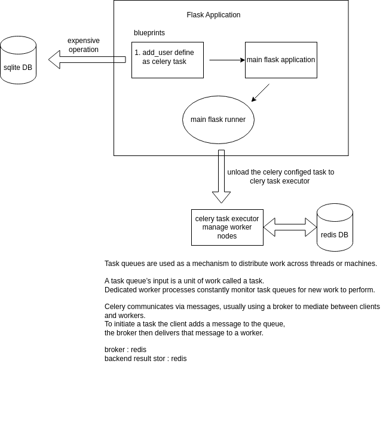

# Flask Celery Async Tasks

### [View all Roadmaps](https://github.com/nholuongut/all-roadmaps) &nbsp;&middot;&nbsp; [Best Practices](https://github.com/nholuongut/all-roadmaps/blob/main/public/best-practices/) &nbsp;&middot;&nbsp; [Questions](https://www.linkedin.com/in/nholuong/)
 

Repo describes how to integrate flask with celery and redis to achieve asynchronous background task execution

# Solution Diagram

# Solution Steps

### Task 1. define flask app with blueprints 
ToDO.

### Task 2. create sqlite3 db and connect with flask
ToDO.

### Task 3. modify the code base into celery compatible way
ToDO.

### Task 4. install redis and init redis server
ToDO.

### Task 5. initiate celery worker process with worker nodes
ToDO.

# 🚀 I'm are always open to your feedback.  Please contact as bellow information:
### [Contact ]
* [Name: nho Luong]
* [Skype](luongutnho_skype)
* [Github](https://github.com/nholuongut/)
* [Linkedin](https://www.linkedin.com/in/nholuong/)
* [Email Address](luongutnho@hotmail.com)

# License
* Nho Luong (c). All Rights Reserved.🌟